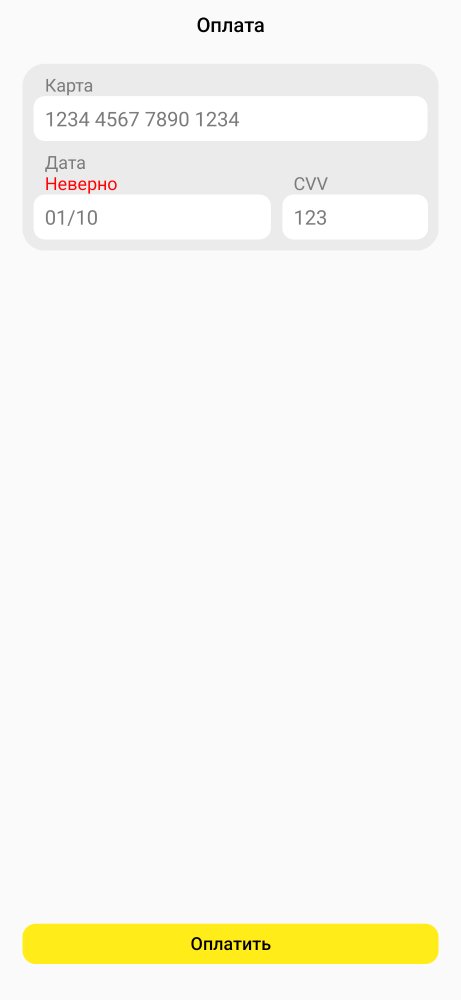

#  Задача 11 | Оплата – UI

[⬅️ назад](../README.md)

## ТЗ

Необходимо реализовать UI экрана оплаты.

### Макет

[Ссылка на макет](https://www.figma.com/design/M0ekYZvZTfk2bVRLjEtGLf/PROD-%E2%80%93-mobile-%E2%80%93-2025?node-id=1-30809&t=bEgQYPcZAqFDFqiQ-4)

#### Заголовок экрана
* Размеры: по ширине контента, по высоте контента
* Цвет текста: `#000000`
* Размер текста: 18sp
* Шрифт: sans-serif-medium
* includeFontPadding = false

#### Форма оплаты

**Задний фон:**
* Цвет: `#EBEBEB`
* Радиус: 20dp

**Заголовки в форме оплаты:**
* Размеры: по ширине контента, по высоте контента
* Цвет текста: `#7A7A7A`
* Размер текста: 16sp
* includeFontPadding = false

**Текст "Неверно":**
* Размеры: по ширине контента, по высоте контента
* Цвет текста: `#FF0000`
* Размер текста: 16sp
* includeFontPadding = false
* Текст должен быть между заголовком и полем ввода
* В случае полей для ввода даты и CVV, контент должен прилегать к нижнему краю формы для ввода. См 

**Поле ввода данных карты:**
* Размеры: по ширине контента, высота 40dp
* Цвет текста: `#7A7A7A`
* Цвет подсказки: `#CBCACB`
* Цвет заднего фона: `#FFFFFF`
* Радиус заднего фона: 10dp
* Символ плейсхолдера: `•`
* Размер текста: 18sp
* Padding в начале: 10dp
* В случае полей для ввода даты и CVV, они должны быть размером 57% и 37% от ширины формы для ввода

#### Кнопка "Оплатить"
* Размеры: по ширине контента, высота 36dp
* Стиль кнопки: `?android:attr/borderlessButtonStyle`
* Цвет заднего фона: `#FFEC18`
* Радиус заднего фона: 12dp
* Elevation: 0dp
* Шрифт: sans-serif-medium
* Размер текста: 16sp
* Цвет текста: `#000000`
* includeFontPadding = false
* padding = 0dp
* textAllCaps = false
* Когда оплата недоступна, кнопка должна быть неактивной (enabled = false)

### Рекомендации

Для конвертирования `dp` -> `px` и обратно в коде можно использовать методы из файла `UnitConverter`:
* spToPx(): Float
* dpToPx(): Int
* dpToPxAsFloat(): Float

В качестве основного контейнера используйте `ConstraintLayout`, размер полей для ввода в процентах можно указать при помощи `app:layout_constraintWidth_percent`

### Эталон

## Ограничения

Из класса `PaymentScreenView` нельзя удалять/менять сигнатуру методов:
- конструктора,
- updatePaymentScreen(paymentState: PaymentState, onCardNumberChanged: (String) -> Unit, onCardDateChanged: (String) -> Unit, onCardCvvChanged: (String) -> Unit, onPayButtonClicked: (PaymentState) -> Unit)

т.к эти методы используется другими классами

## Ожидаемое решение

Необходимо реализовать `PaymentScreenView` в соответствии с макетом, в том числе реализовать логику внутри метода инициализации баннера `setupBanner(model: BannerUiModel)`

(в своей реализации вы можете на свое усмотрение выбрать класс от которого будет наследоваться `PaymentScreenView`, в эталонном решении в качестве основного контейнера использовался `ConstraintLayout`)